## Logging in:
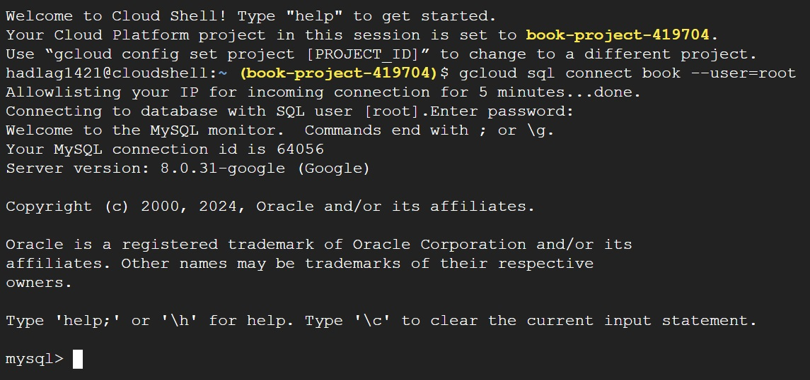

## DDL Commands:
```
CREATE TABLE Users (
    user_id INT NOT NULL,
    first_name VARCHAR(250) NOT NULL,
    last_name VARCHAR(250),
    email VARCHAR(250),
    PRIMARY KEY (user_id)
);


CREATE TABLE Reviews (
    review_id INT NOT NULL,
    user_id INT NOT NULL,
    review_date DATE,
    Stars INT NOT NULL,
    review_text TEXT,
    book_id INT NOT NULL,
    book_title TEXT,
    PRIMARY KEY (review_id),
    FOREIGN KEY (user_id) REFERENCES Users(user_id),
    FOREIGN KEY (book_id) REFERENCES Books(book_id)
);

CREATE TABLE Books (
    book_id INT NOT NULL,
    book_title TEXT,
    publisher_id INT NOT NULL,
    description TEXT,
    ISBN TEXT,
    Image_URL TEXT,
    release_date DATE,
    PRIMARY KEY (book_id),
    FOREIGN KEY (publisher_id) REFERENCES Publisher(publisher_id)
);

CREATE TABLE Author (
    author_id INT NOT NULL,
    first_name VARCHAR(250),
    last_name VARCHAR(250),
    Website TEXT,
    PRIMARY KEY (author_id)
);

CREATE TABLE Publisher (
    publisher_id INT NOT NULL,
    publisher_name VARCHAR(250),
    address VARCHAR(512),
    email VARCHAR(512),
    website VARCHAR(512),
    PRIMARY KEY (publisher_id)
);

CREATE TABLE Genres (
    genre_id INT NOT NULL,
    genre_name VARCHAR(250) NOT NULL,
    PRIMARY KEY (genre_id)
);

CREATE TABLE Genres_Users (
    user_id INT NOT NULL,
    genre_id INT NOT NULL,
    PRIMARY KEY (user_id, genre_id),
    FOREIGN KEY (user_id) REFERENCES Users(user_id),
    FOREIGN KEY (genre_id) REFERENCES Genres(genre_id)
);

CREATE TABLE Genres_Book (
    book_id INT NOT NULL,
    genre_id INT NOT NULL,
    PRIMARY KEY (book_id, genre_id),
    FOREIGN KEY (book_id) REFERENCES Books(book_id),
    FOREIGN KEY (genre_id) REFERENCES Genres(genre_id)
);

CREATE TABLE Author_Book (
    book_id INT NOT NULL,
    author_id INT NOT NULL,
    PRIMARY KEY (book_id, author_id),
    FOREIGN KEY (book_id) REFERENCES Books(book_id),
    FOREIGN KEY (author_id) REFERENCES Author(author_id)
);
```
Each tablet contains more than 1000 rows, here are some examples:

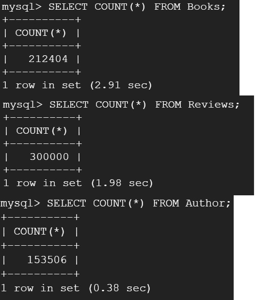

## Advanced Queries
### First Query
1- The SQL query will help us determine which publishers have the highest average book ratings for science fiction, providing insights into which publishers might be producing quality content in that genre.
```
SELECT
    P.publisher_name,
    AVG(R.Stars) AS average_rating,
    COUNT(R.review_id) AS total_reviews
FROM
    Publisher P
JOIN Books B ON P.publisher_id = B.publisher_id
JOIN Genres_Book GB ON B.book_id = GB.book_id
JOIN Genres G ON GB.genre_id = G.genre_id AND G.genre_name = 'Science Fiction'
JOIN Reviews R ON B.book_id = R.book_id
WHERE P.publisher_name != "publisher_name"
GROUP BY
    P.publisher_name
HAVING
    COUNT(R.review_id) > 5
ORDER BY
    AVG(R.Stars) DESC;
```
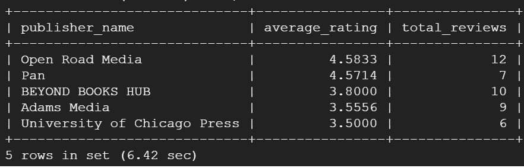
We only considered publishers with more than five reviews to get a better result, this caused us to get only 5 rows.

### Second Query
2- This query will identify the top 15 authors based on the average ratings of their books that have received at least 10 reviews.

```
SELECT 
    A.first_name,
    A.last_name,
    AVG(R.Stars) AS average_rating
FROM 
    Author A
JOIN Author_Book AB ON A.author_id = AB.author_id
JOIN Books B ON AB.book_id = B.book_id
JOIN Reviews R ON B.book_id = R.book_id
WHERE
    B.book_id IN (
        SELECT 
            R2.book_id
        FROM 
            Reviews R2
        GROUP BY 
            R2.book_id
        HAVING 
            COUNT(R2.review_id) >= 10
    )
GROUP BY 
    A.author_id
ORDER BY 
    AVG(R.Stars) DESC
LIMIT 15;

```
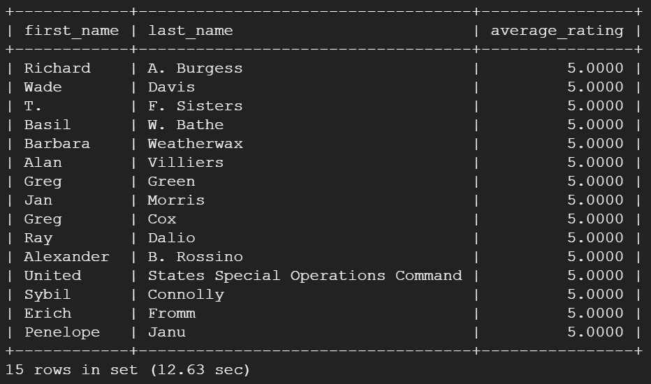

### Third Query:
3- This query will calculate the average rating of each book published in or after 2010 along with the total count of authors per book, providing a comprehensive overview of how books perform in terms of ratings and collaborative authorship. It only considers books with more than 3 reviews

```
SELECT 
    B.book_title,
    AVG(R.Stars) AS average_rating,
    (
        SELECT COUNT(DISTINCT AB.author_id)
        FROM Author_Book AB
        WHERE AB.book_id = B.book_id
    ) AS author_count
FROM 
    Books B
LEFT JOIN Reviews R ON B.book_id = R.book_id
WHERE 
    B.release_date > '2010-01-01'
GROUP BY 
    B.book_id, B.book_title
HAVING 
    COUNT(R.review_id) > 3
ORDER BY 
    author_count DESC
LIMIT 15;
```
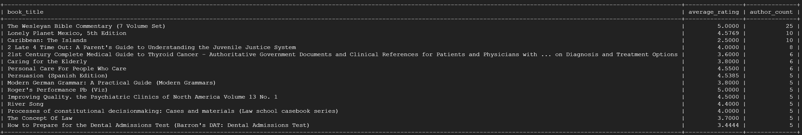

### Fourth Query:
This query focuses on identifying the top-rated genres based on the average book ratings and also counts how many books fall into each genre
```
SELECT 
    G.genre_name,
    AVG(R.Stars) AS average_rating,
    COUNT(DISTINCT B.book_id) AS number_of_books
FROM 
    Genres G
JOIN Genres_Book GB ON G.genre_id = GB.genre_id
JOIN Books B ON GB.book_id = B.book_id
JOIN Reviews R ON B.book_id = R.book_id
GROUP BY 
    G.genre_name
HAVING 
    AVG(R.Stars) >= 4 AND
    COUNT(DISTINCT B.book_id) >= 5
ORDER BY 
    average_rating DESC
LIMIT 15;
```
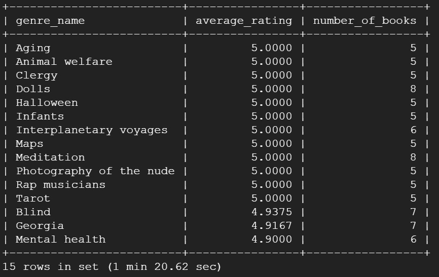

### Fifth Query: 
Display each user's first name, last name, and their average rating to books, only including users who have submitted at least two reviews.


```
SELECT 
    U.user_id,
    U.first_name,
    U.last_name,
    UserStats.average_rating,
    UserStats.total_reviews
FROM 
    (
        SELECT 
            R.user_id,
            AVG(R.Stars) AS average_rating,
            COUNT(R.review_id) AS total_reviews
        FROM 
            Reviews R
        GROUP BY 
            R.user_id
        HAVING 
            COUNT(R.review_id) >= 2
    ) AS UserStats
JOIN Users U ON UserStats.user_id = U.user_id
ORDER BY 
    UserStats.total_reviews DESC, UserStats.average_rating
LIMIT 15;
```

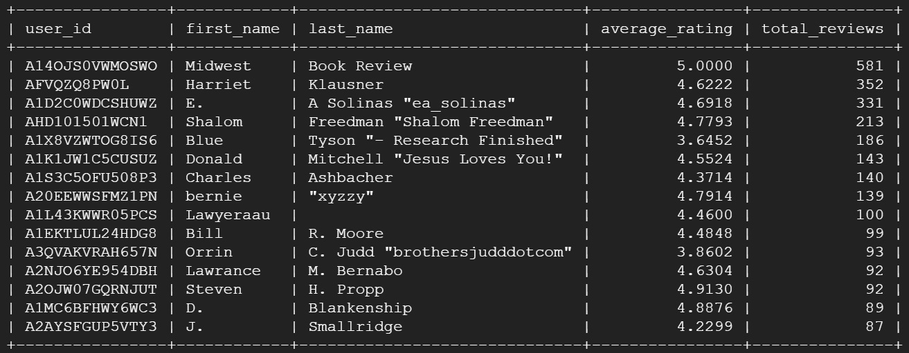
Looks like Midwest Book Reviews does not have a lot of standards!

#Part 2:
### First Query:
First, we will try to run the code without creating any indexes.
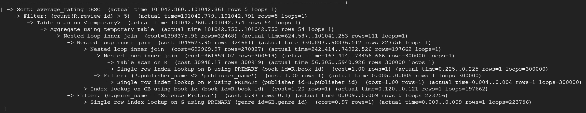
It took 1 minute and 41 seconds. I think if we added an index on publisher name it will be faster because we use the name in the filtering
```
CREATE INDEX idx_publisher_name ON Publisher(publisher_name);
```
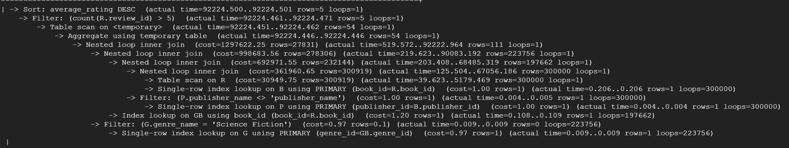
We can see that it became faster by nearly 10 seconds, it only took 1 minute and 32 seconds.
We will delete this index and try another one and see if we can improve it or not
The second index is on genre name, I think it might make the query faster since we use the genre name to filter to only include 'Science Fiction'
```
CREATE INDEX idx_genres_name ON Genres(genre_name);
```
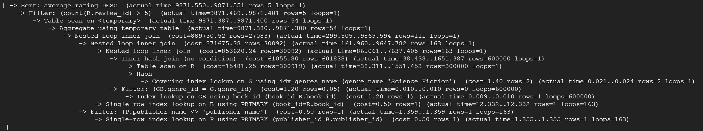
It only took 10.14 seconds! Just as I thought, creating an index on genre name greatly reduces the time; it took 1 minute and 30 seconds less than the original run.
Now, we will try to run it with the two previous indexes. 
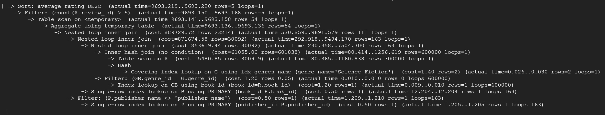
As expected, this took the least time, it ran in 9.85 seconds.

Initially, we ran our SQL query without any indexes, and it took 1 minute and 41 seconds to complete. Believing performance could be improved, we added an index on the publisher name since this field is used in the query's filtering criteria. This change reduced the query time by nearly 10 seconds, bringing it down to 1 minute and 32 seconds. To explore further optimization, we removed this index and tested another on the genre name, motivated by our filter that specifically includes only 'Science Fiction'. This adjustment significantly improved performance, cutting the query time to just 10.14 seconds—a reduction of 1 minute and 30 seconds compared to the original run. Encouraged by these results, we then decided to run the query with both the publisher name and genre name indexes simultaneously. As anticipated, this configuration yielded the best performance, completing the query in only 9.85 seconds.

### Second Query:
First, we will analyze it without any indexes:
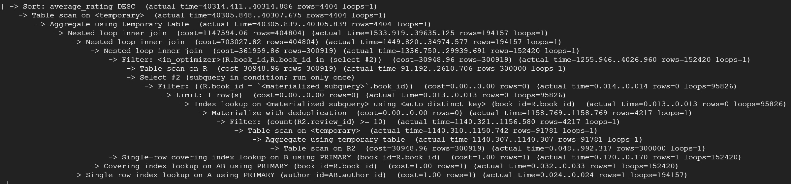
It took 40.32 seconds.
Now, we will create an index on book_id in the Reviews table, I think it'll lower the cost because this field is used in the join and it's a foreign key.
```
CREATE INDEX idx_reviews_book_id ON Reviews(book_id);
```
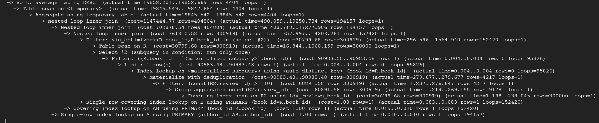
It only took 19.86 seconds, which is half the original time.
Now, we will delete the index and try to create an index on starts, I think it will improve the cost a little. It is not used in a join, but used in an aggregated variable
```
CREATE INDEX idx_reviews_book_id_stars ON Reviews(Stars);
```
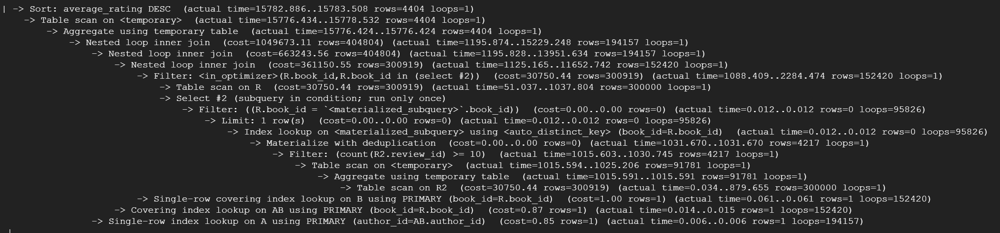
Surprisingly, it only took 15.79 seconds, which is better than the original run by nearly 25 seconds.
Now, we will combine the two indexes and run them together.
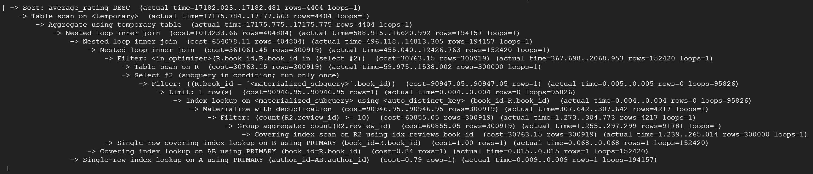
It finished running in 17.18 seconds, we can see that some of the costs were lower, and even the number of operations was lower, but there was a huge increase in one of the filter operations' cost

Initially, we executed our SQL query without any indexes, and it took 40.32 seconds to complete. To optimize this, we decided to create an index on book_id in the Reviews table since this field is crucial for join operations and serves as a foreign key. This modification significantly improved the query's performance, reducing the execution time to 19.86 seconds, which is nearly half the original time.

Next, we removed the previous index and experimented with creating an index on Stars, which is used in an aggregated variable but not in joins. Surprisingly, this change further reduced the execution time to 15.79 seconds, improving the initial time by nearly 25 seconds. This improvement was unexpected because the index wasn't on a join column, suggesting that optimizing aggregation calculations can be highly effective.

Finally, we attempted to combine both indexes on book_id and Stars and reran the query. The result was a completion time of 17.18 seconds. While this was still better than the initial run without indexes, we observed a mixed impact on performance. Some costs were lower, and the number of operations decreased, but there was a noticeable increase in the cost of one of the filter operations. This illustrates that while multiple indexes can provide benefits, they may also introduce complexities in query optimization, affecting some parts of the execution plan negatively.

### Third Query:
First, we will run it without any indexes.

It took 5.86 seconds, which is reasonable considering it is a fairly simple and straightforward query. 
We will create an index on Starts in the reviews table because it is used in an aggregation operation. 
```
CREATE INDEX idx_reviews_stars ON Reviews(Stars);
```
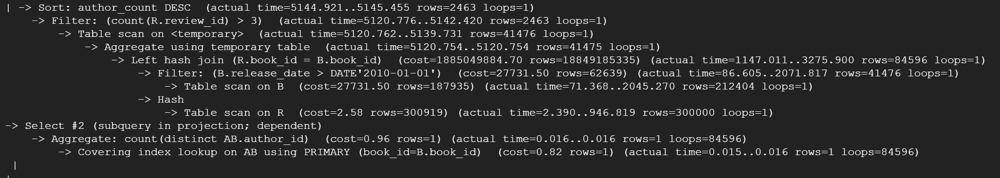
After the index, it only took 5.16 seconds, which is not much, but it is still a 12% improvement.
We will now try it with an index on book release date, I think it will slightly increase the performance since it is used in a where clause
```
CREATE INDEX idx_books_date ON Books(release_date);
```
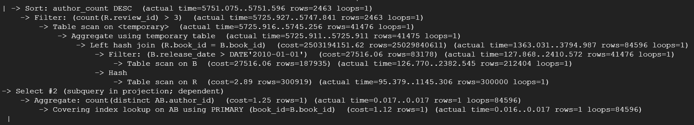
It took 5.82 seconds, which is very similar to the running time without any indexes, it seems like this index does not help much.
We will try now with both indexes.
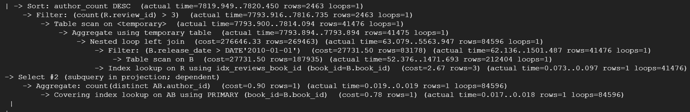
Using both indexes actually increased the time, taking an overall 7.88 seconds to execute, I think this is mainly because the sorting took more time. We can see that when using both indexes, a nested loop left join was used, whereas without indexes a left hash was used. The nested loop join preformed better but the sorting took much more time, resulting in the increased time.

Initially, we executed our SQL query without any indexes, and it took 5.86 seconds to complete, which was reasonable given the simplicity of the query. We then decided to improve performance by creating an index on the Stars column in the Reviews table since it is used in an aggregation operation. This modification reduced the execution time to 5.16 seconds, a modest but notable improvement of 12%. 
Next, we created an index on the release_date column in the Books table, which is utilized in a WHERE clause, hoping it would further enhance performance. However, the addition of this index did not significantly impact the execution time, which remained close to the original at 5.82 seconds, suggesting that this index wasn't particularly effective.
Finally, we tested the query with both indexes applied. Surprisingly, this combination led to an increase in the execution time to 7.88 seconds. The analysis indicated that the slowdown was primarily due to more time-consuming sorting operations. We observed a change in the execution plan where a nested loop left join was used instead of a left hash join. While the nested loop join performed better for the joining process, the added complexity in sorting resulted in an overall longer execution time.

### Fourth Query:
Running the query without indexes took 1 minute and 20.92 seconds,
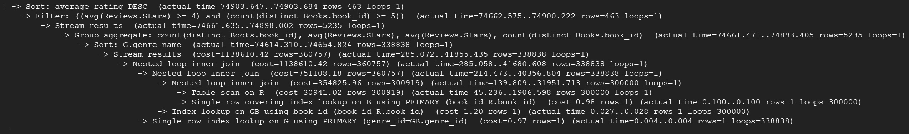
An index on genre name can enhance the performance of the group by statement.
```
CREATE INDEX idx_genres_genre_id ON Genres(genre_name);
```
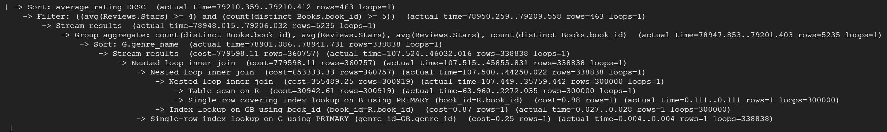
The index decreased the time to 1 minute and 15 seconds.
Next, I tried to create an index on book_id in the reviews table because we used it in the join, but the time took much longer and it did not execute. 
So I created an index on the stars in the reviews table
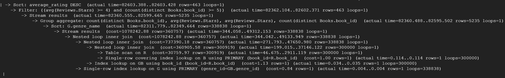
The time did not decrease much, I think because there is no disparity in the data.
Now we will try the indexes together.
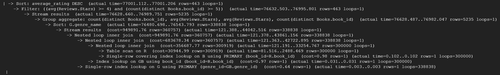
Using the indexes together did not affect the cost much, the total runtime was 1 minute and 17 seconds, which means there was nearly no benefit from it

Initially, running the SQL query without any indexes took 1 minute and 20.92 seconds. To improve performance, an index on the genre name was created to enhance the efficiency of the group by statement, which decreased the execution time to 1 minute and 15 seconds. Subsequently, an attempt to create an index on book_id in the reviews table, intended to speed up joins, was unsuccessful as it caused the query not to execute. An alternative approach involved creating an index on the stars column in the reviews table; however, this did not significantly reduce the time, likely due to a lack of disparity in the data. Finally, combining the indexes and running them together resulted in a total runtime of 1 minute and 17 seconds, showing that using the indexes together offered no substantial benefit because of the reasons discussed above.

