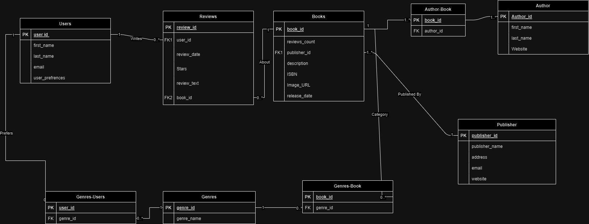

## UML Diagram

## Schema
Users(user_id: INT NOT NULL [PK], first_name: VARCHAR(250) NOT NULL, last_name: VARCHAR(250), email: VARCHAR(250)) \
Reviews(review_id: INT [PK] NOT NULL, user_id: INT [FK to Users.user_id] NOT NULL, review_date: DATE, Stars: INT NOT NULL, review_text: TEXT, book_id: INT NOT NULL [FK to Books.book_id])\
Books(book_id: INT NOT NULL [PK], publisher_id: INT NOT NULL [FK to Publisher.publisher_id], description: TEXT, ISBN TEXT, Image_URL: TEXT, release_date: date,)\
Author(author_id: INT NOT NULL [PK], first_name: VARCHAR(250), last_name: VARCHAR(250), Website: TEXT)\
Publisher(publisher_id: INT NOT NULL [PK], publisher_name: VARCHAR(250), address: VARCHAR(512), email: VARCHAR(512), website: VARCHAR(512))\
Genres(genre_id: INT NOT NULL [PK], genre_name: VARCHAR(250) NOT NULL)\
Genres-Users(user_id: INT NOT NULL[PK][FK to User.user_id], genre_id: INT NOT NULL [PK][FK to Genres.genre_id])
Genres-Book(book_id:INT NOT NULL[PK][FK to Books.book_id], genre_id: INT NOT NULL [PK][FK to Genres.genre_id])
Author-Book(book_id: INT NOT NULL[PK][FK to Books.book_id], author_id: INT NOT NULL [PK][FK to Authors.author_id])

## Assumptions
Certain fields are designated as non-nullable, meaning they must have a value upon record creation. For example, Users must have a user_id, first_name, and email; Reviews require a review_id, user_id, Stars, and book_id; Books need a book_id, reviews_count, author_id, publisher_id, and Genres; Authors and Publishers must have at least an author_id/publisher_id respectively.

Some fields are optional, such as last_name for Users and Authors, and various contact information for Publishers. This implies that the system allows for some flexibility in the information required for certain entities.

We assume that every book is associated with at least one author, though it may be linked to multiple authors, establishing a one-to-many relationship. This relationship is depicted by a joining table called Books-Authors where every row contains a book and one of its authors.

Additionally, the users' prefrances are managed through the User_Genre_Preferences joining table, which holds the fields user_id and genre_id. This allows a user to be associated with multiple genres and facilitates the maintenance of many-to-many relationships between users and genres.

Similarly,  we have introduced the Book_Genres joining table, which captures the many-to-many relationship between books and genres. Each record in the Book_Genres table associates a single book with a single genre, enabling books to be related to multiple genres.

## Normalization
The database schema has already been normalized to conform with Boyce-Codd Normal Form (BCNF). To accurately represent the many-to-many relationships without violating BCNF principles, we have created three joining tables:

Author-Book: This joining table captures the many-to-many relationship between authors and books. Each record in this table contains author_id and book_id, linking a single author to a single book and thereby allowing for multiple authors to be associated with a single book.

Genres-Users: This joining table addresses the many-to-many relationship between users and genres. By including user_id and genre_id in each record, the table enables a user to have preferences for multiple genres.

Genres-Book: Similarly, this joining table is designed to represent the many-to-many relationship between books and genres. It holds book_id and genre_id, allowing a single book to be categorized under multiple genres.

With this, the dependencies become:

1. Users Table:
user_id is the primary key.
All other attributes (first_name, last_name, email) depend directly on user_id.
There are no non-trivial dependencies where the left-hand side is not a superkey, because user_id is the only key and all attributes depend on it.

1. Books Table:
book_id is the primary key.
All other attributes (reviews_count, publisher_id, description, ISBN, Image_URL, release_date) depend directly on book_id.
The foreign key publisher_id references the primary key of the Publisher table and there are no attributes in Books that depend on publisher_id—it only establishes a link.

1. Reviews Table:
review_id is the primary key.
All other attributes (user_id, book_id, review_date, Stars, review_text) depend directly on review_id.
user_id and book_id are foreign keys that reference their respective tables, establishing a link without introducing any transitive dependencies.

1. Author Table:
author_id is the primary key.
All other attributes (first_name, last_name, Website) depend directly on author_id.

1. Publisher Table:
publisher_id is the primary key.
All other attributes (publisher_name, address, email, website) depend directly on publisher_id.

1. Genres Table:
genre_id is the primary key.
The attribute genre_name depends directly on genre_id.

1. Joining Tables (Author-Book, Genres-Users, Genres-Book):
Each joining table has a composite primary key made up of two foreign keys that together form a unique identifier for the records.
In Author_Book, the primary key is (book_id, author_id), in User_Genre_Preferences, it is (user_id, genre_id), and in Genres_Book, it is (book_id, genre_id).
There are no other attributes in these tables, so all non-trivial dependencies have their left-hand side as a superkey.

